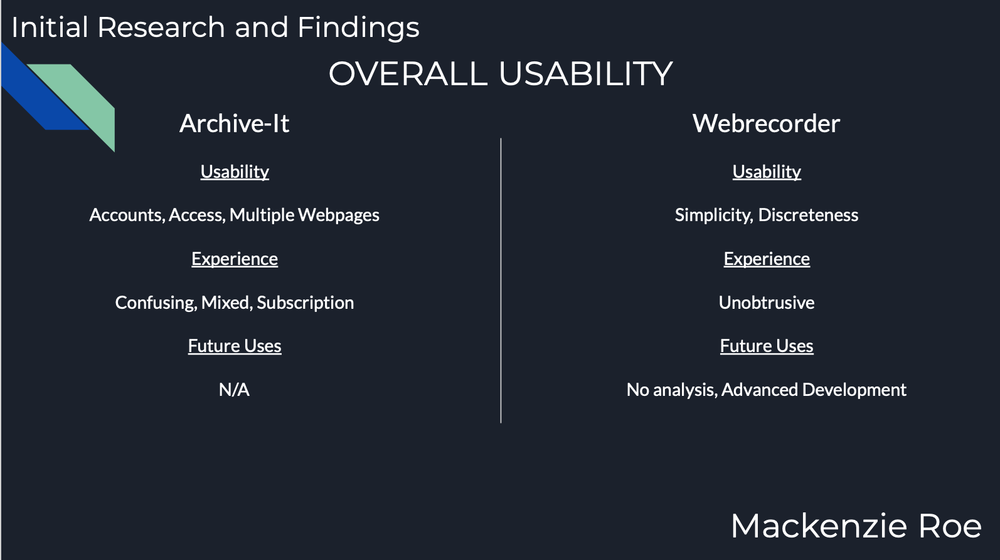
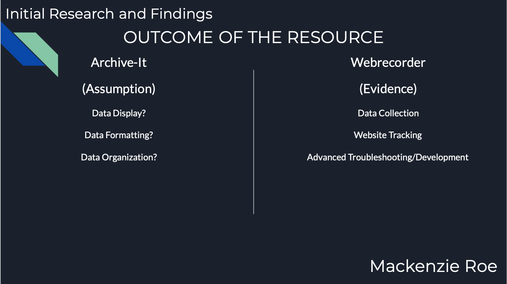

# IASC 2P02 | Mackenzie Roe

## Bio:

As a digital humanist myself, I find discussing new forms of information gathering, analysis and visualization extremely interesting and fun. As a second-year Brock University  IASC (Interactive Arts and Science) student, being able to explore all areas of Digital Humanities allows for a great time in class discussions and to gain a larger insight into the digital world and how it affects us all. With all of my projects to date within the course 2P02 as well as other courses throughout my major and electives I have been able to specialize in my wanted career which is User Interface/User Experience Design. With both written and applied work being relatable to design and user understanding, I have been able to increase my skills and set up a strong portfolio to have me prepared for Co-Ops and internships as well as career preparedness. My portfolio displays work that was completed by me in high school as well as university projects and work. This allows the reader to visualize exactly how my techniques and skills have grown over time and how they have evolved over my participation in the Interactive Arts and Science program. With pursuing a career within digital humanities I would also like to continue writing about data sets and visualization tool, how over time we will have to come up with new ways of comparing information that was once thought of as not being possible. A great example of this would be finding new creative ways to compare two data sets that were once not possible, comparing dogs with planes. This comparison wouldn't make much sense but with a digital humanities mindset, it could become possible. I am setting out to help change the way we compare data sets and I hope to one day be able to make an impact.

## Featured Project: [Blog Post](Revised_Blog.md)

Introduction:

Within my blog post Finding New Ways to Compare, I explore multiple texts within digital humanities were data sets and data visualization or represented and interpreted in many different ways from the norm. Traditionally, when information is visualized or represented within a graph, it can only be displayed in a linear matter or compared to similar items. Throughout this blog post, I explore how that can now be changed by manipulating the way data is represented on such graphs. This blog post has great significance within the digital humanities field for many reasons. It opens the space for free interpretation for the reader, allowing for a more significant impact on the reader. I personally find that after publishing this post is will allow people that are new to digital humanities to have a greater understanding as to how we think differently and constantly push things to the next level. With my research findings, I was able to find that it is a common trend for digital humanists to think outside of the box and to now start finding new ways of completing tasks that have been completed the same way for some time. This can translate into the graphs shown within my blog post as graphs that were once linear and simply comparing similar data sets, digital humanists open up the space to compare things that were once thought of as uncomparable thanks to these new findings and ways of thinking. To conclude this blog post will introduce newcomers to the way we think as digital humanists and how we are shaping the future. 

Description of my evolving research and changes: 

After revising my blog post, I have come to realize how my research and way of thinking have evolved over time. At the beginning of this course, I was very narrow-minded in my points and I did not have much room for free interpretation on other points or topics that were discussed throughout this course. But now, come the end of  IASC 2P02, I find myself being very open to new ways of thinking and approaching topics. This greatly reflects my work and can be displayed throughout my blog post in many ways. By making my revisions from the original feedback on my blog post I am able to gather exactly what input was given based on my work. Where in the past I would simply read the comments and not completely understand what was being suggested in order to improve, I am not able to properly read professor comments and see exactly where I can improve. This can also be shown by the changes I have made to my blog post thanks to the feedback received.

Change 1: [here](https://github.com/mackenzieroe/IASC-2P02/commit/80a0c77d4d2bca1ec92c3cb1c52e603b6ffbd70f) Description: To fix an issue that I had with the original blog post is to change how quickly I moved into Drucker’s graph. In order to fix this, I created a better introduction to the image to allow the reader to better comprehend what I was trying to display.

Change 2: [here](https://github.com/mackenzieroe/IASC-2P02/commit/86f395133f7a6d77c5d589542ffaa9d1a1fae97f) Description: The comment that Moretti’s graph needs more explanation as to how they are non-linear was fix by simply adjusting the paragraph and adding more explanation to my point.

Change 3: [here](https://github.com/mackenzieroe/IASC-2P02/commit/b9d2ce55f4d05efc8758af846c7d9260089bd117) Description: In addition to the changes under “Change 2” I built upon the comment that Moretti’s claims about progress as an oscillation or a pendulum might allow us to view those linear graphs in non-linear ways was fixed by expanding upon this point.  

Read [Finding New Ways to Compare](Revised_Blog.md)

## Collaborative Project

Project Description:

For our group presentation, we were tasked with using and presenting the topic modelling tool The Archives Unleashed Cloud. Unfortunately due to the multiple accounts, subscription fees and requested permission to access the main tool we were unable to access the main topic modelling tool. We were able to access the tools surrounding The Archives Unleashed Cloud so we could gain a basic understanding of how it was utilized and what it actually provided. A surrounding tool that I was able to access was Webrecorder, this tool would allow the user to save and track every link clicked on a web page. My part in the presentation was to compare Archive-it(Main Tool) and Webrecorder(Additional Tool) which was to tool that we were able to access. 

Collaboration Statement:

My approach to the presentation was to gather as much as possible about the main topic modelling tool Archive-it. Since I came across countless issues with accessing the tool I examined Webrecorder. In order to access Archive-it you needed permission from the company, pay for a subscription and download multiple other tools. There was a countless amount of speed bumps throughout our efforts to access the tool, as a result  we were unable to access it and had to settle for Webrecorder as the tool. In order to properly discuss this and show to the class the troubles with the tool and how private it was, I decided to make my part a comparison. I compared both Webrecorder and Archive-it in two different sections. The first section was on the “Overall Usability” of both programs, this opened up the space for the audience to understand exactly how hard Archive-it was to access. This, in turn, was a great introduction into the next slide which was on the “outcome of the resource” which compared both tools again, but this time gave the audience a clear vision as to what they can both be used for and how each tool can be utilized in the future both for personal and professional use. My portion of the project can be directly related to my bio and the course outcomes, as personally over this course I have grown as a digital humanist and this reflects the quality of my comparison between the two topic modelling tools.

3 Deliverables:

1: 
Description: This is the commit where I uploaded my portion of the slides in text format. 
Link: [here](https://github.com/IascAtBrock/IASC-2P02-TeamPresentations/commit/d3c99b946f2503a6d0f7bf5e8d21bce1b38a8026)

2: 
Description: Picture of slide 3/4
Picture:

{:height="50%" width="50%"}

3: 
Description: Picture of slide 4/4 
Picture: 

{:height="50%" width="50%"}

## Research Presentation

[The Newton and Siri](reveal1/index.html)

## Academic Blog

[Finding New Ways to Compare](blog)

